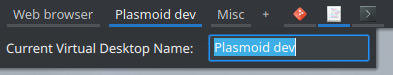

## Minimal Desktop Switcher
This is an applet, a.k.a. plasmoid, for KDE Plasma panel which lets you switch between virtual desktops and also invoke some common actions to manage them in a convenient way. Those actions can be accessed through applet's context menu or user-defined global keyboard shortcuts.

The plasmoid displays virtual desktop entries as text labels with their names. That means there's no icons or window previews like in the Plasma's default pager applet. The intention is to keep it a little bit similar to the default task manager plasmoid.

### Features
* switching to a virtual desktop
* creating a new virtual desktop
* removing last virtual desktop
* removing current virtual desktop
* moving current virtual desktop to left
* moving current virtual desktop to right
* renaming current virtual desktop

### Screenshots

