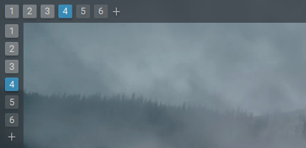

# Virtual Desktop Bar

This is an applet for KDE Plasma panel that lets you switch between virtual desktops and also invoke some actions to dynamically manage them in a convenient way. Those actions can be accessed through applet's context menu or user-defined global keyboard shortcuts. There are also some automated features.

The plasmoid displays virtual desktops as text labels (numbers, names, both) with indicators (various styles). That means there's no icons or window previews like in the Plasma's default Pager applet. Although the intention is to keep it simple, the applet has some options regarding its behavior and visuals, which should be more than enough for desktop customization enthusiasts and folks at [/r/unixporn](https://reddit.com/r/unixporn) who want to make their panels aesthetically-pleasant.

## Features

* switching to a desktop
* switching to a recent desktop
* adding a new desktop
* removing last desktop
* removing current desktop
* moving current desktop to left
* moving current desktop to right
* renaming current desktop

## Automated features

* keeping at least one empty desktop
* removing redundant empty desktops 
* renaming desktops once they become empty
* switching to a manually added desktop
* prompting to rename a manually added desktop
* executing a command after manually adding a desktop

## Screenshots

Adding, renaming, moving, removing a desktop:


Various desktop label styles:


Various desktop indicator styles:


Partial support also for vertical panels:



## Installation

To install the applet, either get it as a distro specific package, or build it from source by yourself.

### Packages

Arch Linux users can get the applet as an [AUR package](https://aur.archlinux.org/packages/plasma5-applets-virtual-desktop-bar-git) made by cupnoodles.

### From source

First, you need to install some required dependencies:

* On Kubuntu or KDE neon, run: `./scripts/install-ubuntu-deps.sh`
* On Arch Linux or Manjaro, run: `./scripts/install-arch-deps.sh`
* On openSUSE, run: `./scripts/install-opensuse-deps.sh`
* On Fedora, CentOS or RHEL, run: `./scripts/install-redhat-deps.sh`

Then, compile the source code and install the applet:

```
mkdir build
cd build
cmake ..
make
sudo make install
```

_Note:_ If you want to remove the applet, use `sudo make uninstall`.

_Note:_ These steps also apply if you want to upgrade to a newer version.

After that, you should be able to find Virtual Desktop Bar in the Widgets menu.

## Configuration

The applet has some options regarding its behavior and visuals. You'll find them in the configuration dialog.

Don't get fooled by an empty Keyboard Shortcuts section though. It's an imposed thing, common for all plasmoids.

There are global keyboard shortcuts, but you have to find and define them in the Global Shortcuts System Settings Module. They should be available under KWin, Plasma or Latte Dock component, depending on the shell's mood and where have you placed the applet. The shortcuts are named like this:
* Switch to Recent Desktop
* Add New Desktop
* Remove Last Desktop
* Remove Current Desktop
* Move Current Desktop to Left
* Move Current Desktop to Right
* Rename Current Desktop

## Known issues

* Virtual desktops are shared by all monitors (KWin's limitation)
* Support for Plasma Wayland session isn't there yet (maybe some day)
* The code behind this applet is a hot mess that begs for a sensible rewrite
* Dynamic virtual desktop management doesn't play nice with KWin tiling scripts (see below)

## Compatibility with KWin tiling scripts

If you want to use this applet with some KWin tiling scripts, they may not work correctly. However, this is only related to some non-standard features that Virtual Desktop Bar provides. I recommend reading [this document](KWIN.md) for more details and tips for KWin script developers which are interested in providing support for the plasmoid.

### Compatible scripts

* [Patched faho's KWin tiling script](https://github.com/wsdfhjxc/kwin-tiling/tree/virtual-desktop-bar)

And that's it. It's a very niche applet, so don't expect more scripts to follow.

_Note:_ You also need to tick a checkbox in the Advanced section of the configuration dialog.
